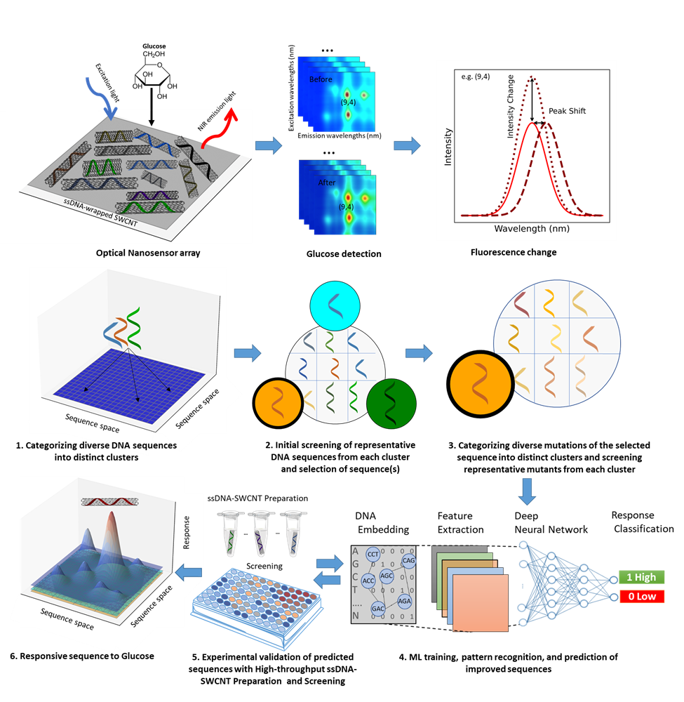

# GlucoseSense-Clustering-and-Deep-Learning-Optimized-ssDNA-SWCNT-Nano-Biosensors
Machine learning-optimized ssDNA-SWCNT nano-biosensors for glucose detection. Using clustering and deep learning, we identified and refined ssDNA sequences to enhance sensor sensitivity, enabling precise, cross-tissue NIR biomarker monitoring. This approach advances non-invasive diabetes management and bio-sensing applications.

